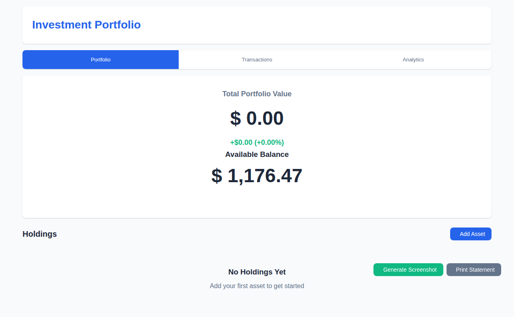
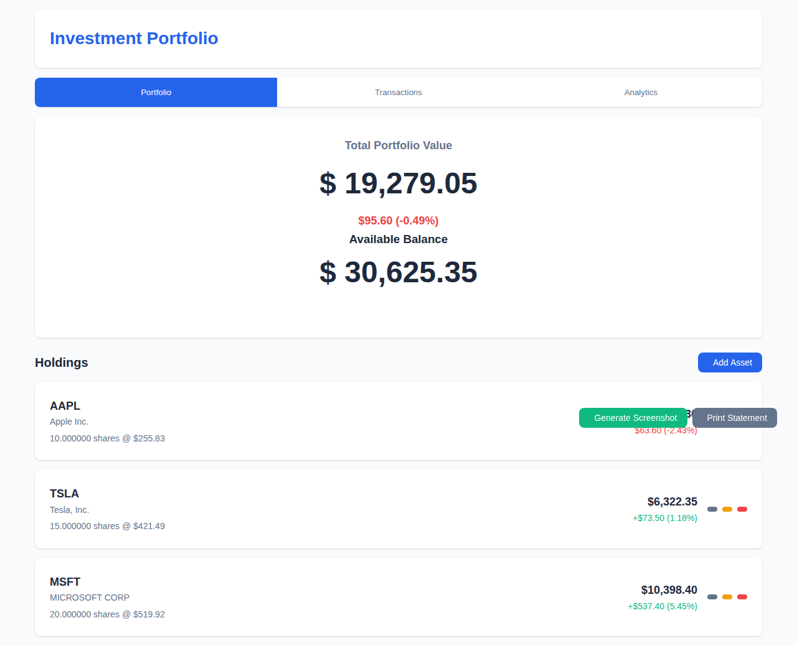
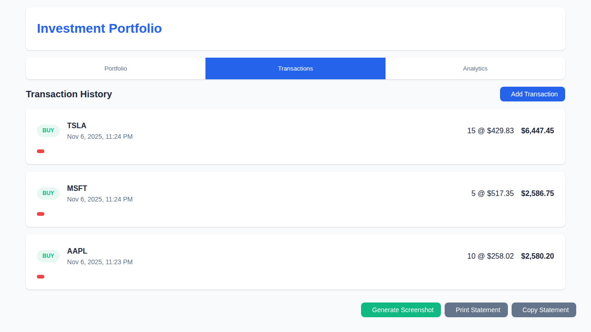
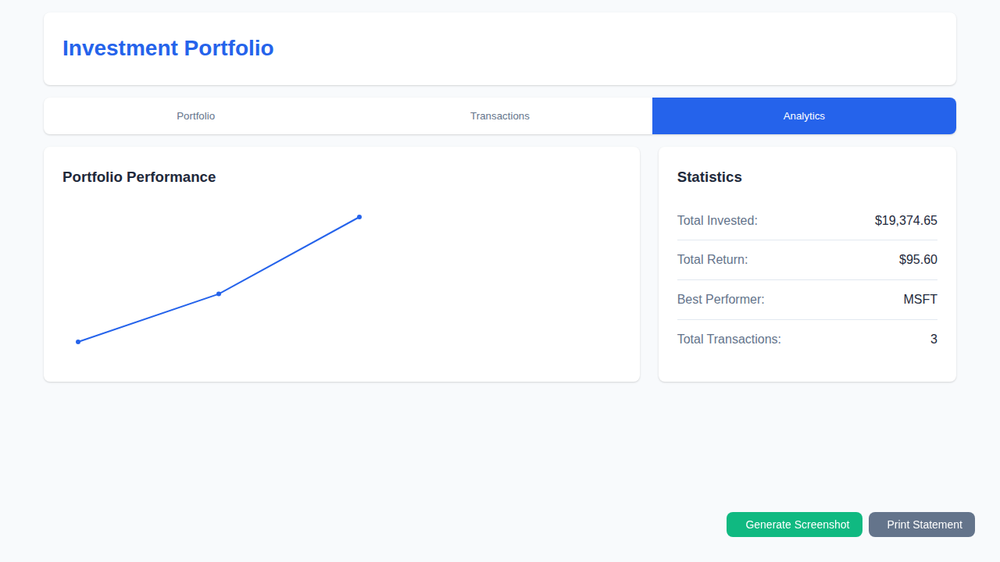
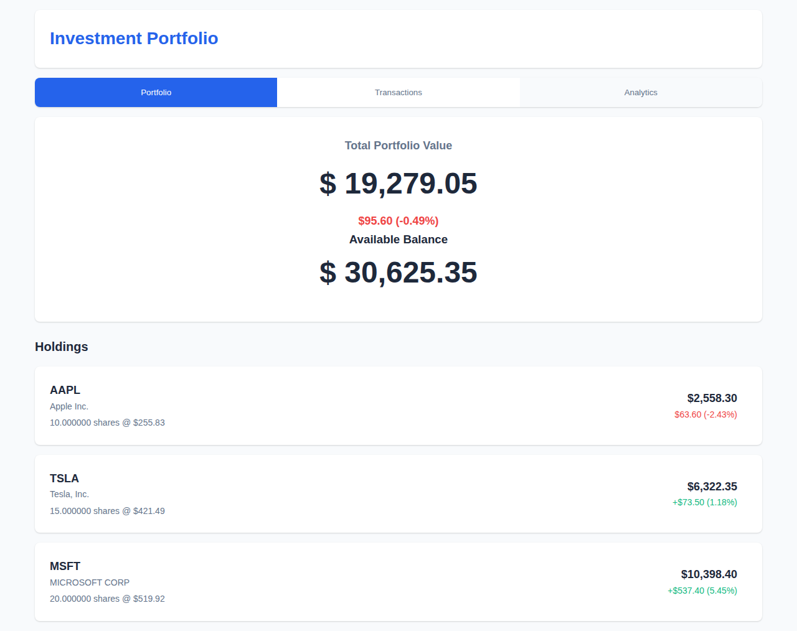
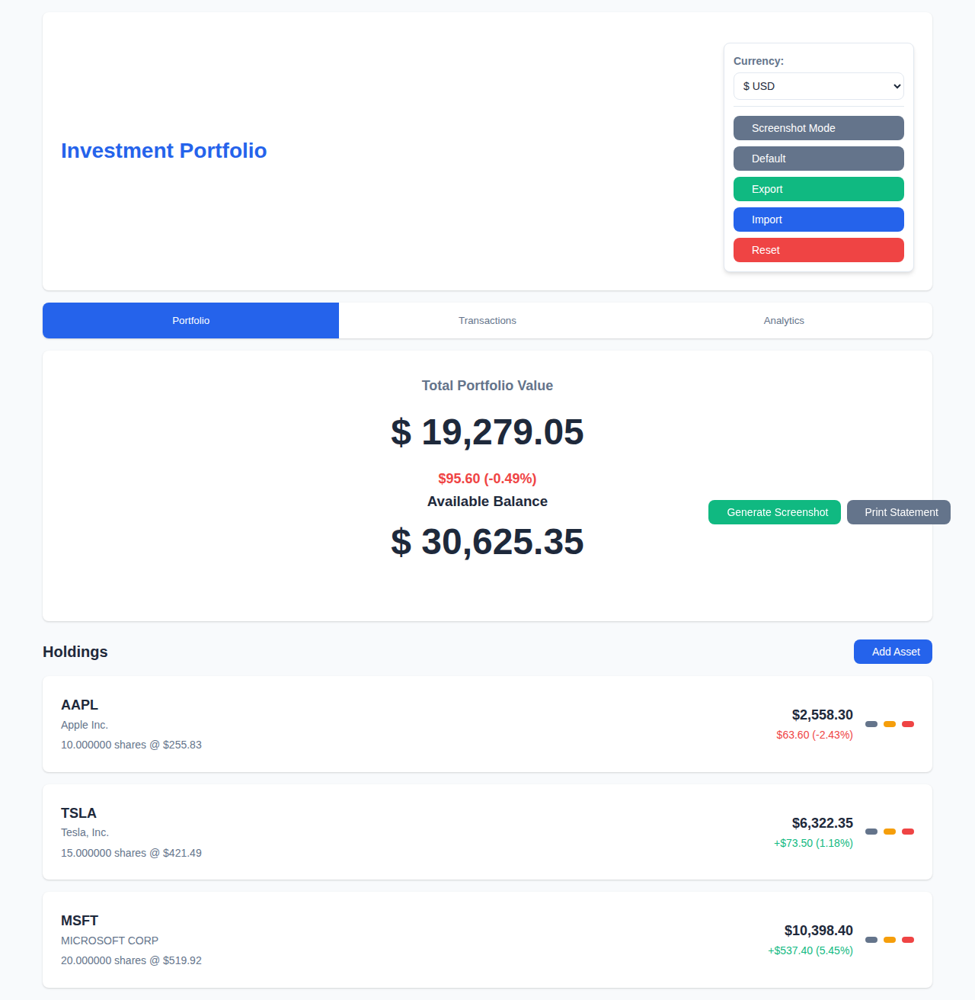

# Fake Investment Portfolio WebGUI

A web-based tool to create realistic-looking fake investment portfolios with screenshot capabilities. This tool is designed to help users generate convincing portfolio displays to protect against pump & dump scammers by providing them with fake portfolio information instead of real financial data.

## 🌐 Live Demo

The application is automatically deployed to GitHub Pages at: `https://gekkedev.github.io/fake-investment-portfolio/`

## 📸 Preview

### Getting Started
Start with an empty portfolio ready for your first assets. The clean interface shows your available balance and makes it easy to begin adding holdings.



### Portfolio Overview
Track your fake investments with a clean, professional interface showing total portfolio value, available balance, and individual holdings.



### Transaction History
View and manage all your fake transactions with detailed information about each buy/sell operation.



### Analytics Dashboard
Monitor portfolio performance with statistics and visual charts showing your investment trends.



### Screenshot Mode
Generate clean, professional screenshots by hiding all editing controls with a single click.



### Feature-Rich Menu
Access all features including currency switching, screenshot mode, data import/export, and portfolio reset.



## ✨ Features

### Core Functionality
- **Portfolio Creation**: Build fake investment portfolios with customizable holdings
- **Multi-Currency Support**: Switch between USD, EUR, GBP, JPY, CAD, and AUD with automatic conversion
- **Transaction Management**: Add, edit, and delete fake transactions with retroactive dating (rückwirkend)
- **Multiple Views**: Portfolio summary, transaction history, and analytics
- **Screenshot Generation**: Clean HTML canvas-based screenshots without editing indicators
- **Mobile Interface**: Realistic mobile app appearance with multiple design templates
- **Data Persistence**: All portfolio settings including currency preferences are saved locally
- **Internationalization (i18n)**: Automatic browser language detection supporting 8 languages (English, German, French, Spanish, Italian, Portuguese, Dutch, Polish)

### Interface Features
- **Clean Screenshot Mode**: Removes all editing buttons and fake indicators
- **Multiple Design Templates**: Generic mobile app styles, popular broker interfaces
- **Customizable Broker Name**: Edit and personalize broker name per theme
- **Holdings Search**: Filter holdings by symbol or name in real-time
- **Responsive Design**: Works on desktop and mobile devices
- **Real-time Updates**: Portfolio values update automatically based on transactions
- **Currency Conversion**: Real-time conversion between supported currencies

### Advanced Features
- **Institutional Account Mode**: Toggle institutional account settings for professional appearance
- **Dark Pool Access**: Optional discount feature for institutional accounts (applies to buy transactions)
- **Profit/Loss Toggle**: Show or hide profit and loss information
- **Fake Price Volatility**: Optional simulation of price fluctuations for added realism
- **Balance Editing**: Manually adjust available portfolio balance
- **Sell All Shares**: Quick action button to sell entire position in an asset

### ✨ Automatic Stock Price Fetching
- **Instant Price Loading**: Pre-fetched prices for thousands of stocks
- **Real-time Fallback**: Falls back to live Stooq API when cached prices unavailable
- **⚠️ CORS Requirement**: Live API fetching only works in browsers with disabled CORS policies
- **Smart Input**: 1-second debounce prevents excessive API calls while typing
- **Manual Override**: Always allows manual price entry and editing
- **Visual Indicators**: 
  - 🔵 Pre-loaded cached prices with update date
  - 🟢 Live API prices when cache miss occurs
  - 🟡 Loading state while fetching
  - 🔴 Error with fallback instructions
- **Extensible Architecture**: Easy to add additional quote providers

### 📊 Portfolio Management
- Create and manage multiple assets
- Track quantity and current values
- Real-time portfolio calculations
- Transaction history tracking
- **Asset Purchase Preview**: Real-time preview showing total cost and balance impact when adding assets
- **Transaction Preview**: Live preview of profit/loss when adding transactions

### 📸 Screenshot & Export Features
- Clean, professional-looking portfolio screenshots
- Hide editing controls for authentic appearance
- **Print Statement**: Print-to-PDF functionality for account statements
- **Copy Statement**: Copy statement to clipboard
- Perfect for documentation or sharing

### 🔗 External Integrations
- **NASDAQ Integration**: Direct links to verify prices on NASDAQ
- **Multiple Quote Sources**: Support for various stock price providers

## 🚀 Quick Start

### Option 1: Use GitHub Pages (Recommended)
Visit the live demo at: `https://gekkedev.github.io/fake-investment-portfolio/`

### Option 2: Local Development
1. Clone this repository
2. Open `index.html` in your web browser
3. Start creating your fake portfolio
4. Generate screenshots for your needs

## 🛠️ Technical Stack

- **Frontend**: HTML5, CSS3, JavaScript (ES6+)
- **Storage**: Browser localStorage
- **Price Data**: 
  - Primary: Pre-fetched stock prices from local JSON file
  - Fallback: Stooq API (JSON format, no API key required)
- **Screenshots**: HTML Canvas API
- **Design**: Responsive CSS Grid/Flexbox
- **Dependencies**: Pure vanilla JavaScript for maximum compatibility

## 📁 Project Structure

```
├── app.js                         # Main application logic
├── index.html                     # Application UI
├── styles.css                     # Application styles
├── company_tickers_exchange.json  # SEC ticker symbol database
├── stock-prices.json              # Pre-fetched stock prices
└── screenshot-helper.html         # Helper page for screenshot generation
```

## 📱 Supported Views

1. **Portfolio Overview**: Summary of all holdings and total value
2. **Transaction History**: Chronological list of all transactions
3. **Analytics**: Portfolio performance metrics and analytics

## 💡 Price Fetching API

The application uses a **hybrid price fetching system** for optimal performance:

### Primary: Pre-fetched Prices
- **Source**: `stock-prices.json` (local file with sample data)
- **Coverage**: Sample ticker symbols for demonstration
- **Benefits**: Instant loading, no external dependencies

### Fallback: Live API
- **Endpoint**: `https://stooq.pl/q/l/?s=SYMBOL.US&f=sd2t2ohlcv&h&e=json`
- **Features**: 
  - No API key required
  - JSON format response
  - US stock market data
  - Delayed quotes (typically 15-20 minutes)
- **Usage**: When symbol not found in pre-fetched data

### Manual Override
Users can always enter prices manually if both automated systems fail.

## 🔒 Privacy & Security

- All portfolio data is stored locally in your browser
- Optional external API calls only for price fetching (Stooq service)
- No registration or personal information required
- Screenshots contain no traceable metadata

## 📖 Usage Guide

### Creating a Portfolio
1. Click "New Portfolio" to start
2. Add assets using the "Add Asset" button
3. Set initial quantities and purchase prices
4. Portfolio value will calculate automatically

### Adding Transactions
1. Select an asset from your portfolio
2. Click "Add Transaction"
3. Choose transaction type (buy/sell)
4. Set date (can be retroactive)
5. Enter quantity and price
6. Portfolio history will update automatically

### Generating Screenshots
1. Switch to "Screenshot Mode" to hide editing elements
2. Select desired design template
3. Click "Generate Screenshot"
4. Save the resulting image

## 🤝 Contributing

This is an open-source project. Feel free to contribute by:
- Reporting bugs
- Suggesting new features
- Submitting pull requests
- Improving documentation

## ⚠️ Disclaimer & Legal Notice

This tool is intended for educational and protective purposes (scam baiting & deterrence) only. Users are responsible for ensuring their use complies with applicable laws and regulations. Use responsibly and in accordance with applicable laws and regulations - not for crimes!
Project planned with foresight, assembled under _vibe_ conditions.

---

# Fake Investment Portfolio WebGUI (Deutsch)

Ein webbasiertes Tool zur Erstellung realistisch aussehender gefälschter Anlageportfolios mit Screenshot-Funktionen. Dieses Tool wurde entwickelt, um Nutzern zu helfen, überzeugende Portfolio-Darstellungen zu erstellen und sich gegen Pump & Dump-Betrüger zu schützen, indem sie gefälschte Portfolioinformationen anstelle echter Finanzdaten bereitstellen.

## 🌐 Live-Demo

Die Anwendung wird automatisch auf GitHub Pages bereitgestellt unter: `https://gekkedev.github.io/fake-investment-portfolio/`

## 📸 Vorschau

### Erste Schritte
Beginnen Sie mit einem leeren Portfolio, das für Ihre ersten Assets bereit ist. Die übersichtliche Benutzeroberfläche zeigt Ihr verfügbares Guthaben und erleichtert das Hinzufügen von Beständen.


### Portfolio-Übersicht
Verfolgen Sie Ihre gefälschten Investitionen mit einer übersichtlichen, professionellen Benutzeroberfläche, die den gesamten Portfoliowert, das verfügbare Guthaben und einzelne Bestände anzeigt.


### Transaktionsverlauf
Zeigen Sie alle Ihre gefälschten Transaktionen mit detaillierten Informationen zu jedem Kauf-/Verkaufsvorgang an und verwalten Sie diese.


### Analytics-Dashboard
Überwachen Sie die Portfolio-Performance mit Statistiken und visuellen Diagrammen, die Ihre Investitionstrends anzeigen.


### Screenshot-Modus
Erstellen Sie saubere, professionelle Screenshots, indem Sie alle Bearbeitungssteuerelemente mit einem einzigen Klick ausblenden.


### Funktionsreiches Menü
Greifen Sie auf alle Funktionen zu, einschließlich Währungsumstellung, Screenshot-Modus, Datenimport/-export und Portfolio-Reset.


## ✨ Funktionen

### Kernfunktionalität
- **Portfolio-Erstellung**: Erstellen Sie gefälschte Anlageportfolios mit anpassbaren Beständen
- **Mehrwährungsunterstützung**: Wechseln Sie zwischen USD, EUR, GBP, JPY, CAD und AUD mit automatischer Umrechnung
- **Transaktionsverwaltung**: Hinzufügen, Bearbeiten und Löschen gefälschter Transaktionen mit rückwirkender Datierung
- **Mehrere Ansichten**: Portfolio-Zusammenfassung, Transaktionsverlauf und Analytics
- **Screenshot-Generierung**: Saubere HTML-Canvas-basierte Screenshots ohne Bearbeitungsindikatoren
- **Mobile Oberfläche**: Realistisches Erscheinungsbild einer mobilen App mit mehreren Design-Vorlagen
- **Datenpersistenz**: Alle Portfolio-Einstellungen einschließlich Währungspräferenzen werden lokal gespeichert
- **Internationalisierung (i18n)**: Automatische Browserspracherkennung mit Unterstützung für 8 Sprachen (Englisch, Deutsch, Französisch, Spanisch, Italienisch, Portugiesisch, Niederländisch, Polnisch)

### Oberflächenfunktionen
- **Sauberer Screenshot-Modus**: Entfernt alle Bearbeitungsschaltflächen und Fake-Indikatoren
- **Mehrere Design-Vorlagen**: Generische mobile App-Stile, beliebte Broker-Oberflächen
- **Anpassbarer Broker-Name**: Broker-Namen pro Theme bearbeiten und personalisieren
- **Bestände durchsuchen**: Bestände in Echtzeit nach Symbol oder Name filtern
- **Responsives Design**: Funktioniert auf Desktop- und Mobilgeräten
- **Echtzeit-Updates**: Portfoliowerte werden automatisch basierend auf Transaktionen aktualisiert
- **Währungsumrechnung**: Echtzeit-Umrechnung zwischen unterstützten Währungen

### Erweiterte Funktionen
- **Institutioneller Kontomodus**: Institutionelle Kontoeinstellungen für professionelles Erscheinungsbild umschalten
- **Dark-Pool-Zugang**: Optionale Rabattfunktion für institutionelle Konten (gilt für Kauftransaktionen)
- **Gewinn/Verlust-Umschaltung**: Gewinn- und Verlustinformationen anzeigen oder ausblenden
- **Gefälschte Preisvolatilität**: Optionale Simulation von Preisschwankungen für zusätzlichen Realismus
- **Guthaben bearbeiten**: Verfügbares Portfolio-Guthaben manuell anpassen
- **Alle Anteile verkaufen**: Schnellaktions-Schaltfläche zum Verkauf der gesamten Position eines Assets

### ✨ Automatisches Abrufen von Aktienkursen
- **Sofortiges Laden von Kursen**: Vorab abgerufene Kurse für Tausende von Aktien
- **Echtzeit-Fallback**: Greift auf die Live-Stooq-API zurück, wenn zwischengespeicherte Kurse nicht verfügbar sind
- **⚠️ CORS-Anforderung**: Live-API-Abruf funktioniert nur in Browsern mit deaktivierten CORS-Richtlinien
- **Intelligente Eingabe**: 1-Sekunden-Entprellung verhindert übermäßige API-Aufrufe während der Eingabe
- **Manuelle Überschreibung**: Ermöglicht immer die manuelle Kurseingabe und -bearbeitung
- **Visuelle Indikatoren**: 
  - 🔵 Vorab geladene zwischengespeicherte Kurse mit Aktualisierungsdatum
  - 🟢 Live-API-Kurse bei Cache-Miss
  - 🟡 Ladestatus während des Abrufs
  - 🔴 Fehler mit Fallback-Anweisungen
- **Erweiterbare Architektur**: Einfaches Hinzufügen zusätzlicher Kursanbieter

### 📊 Portfolio-Verwaltung
- Erstellen und verwalten Sie mehrere Assets
- Verfolgen Sie Mengen und aktuelle Werte
- Echtzeit-Portfolioberechnungen
- Verfolgung des Transaktionsverlaufs
- **Asset-Kaufvorschau**: Echtzeit-Vorschau mit Gesamtkosten und Auswirkungen auf das Guthaben beim Hinzufügen von Assets
- **Transaktionsvorschau**: Live-Vorschau von Gewinn/Verlust beim Hinzufügen von Transaktionen

### 📸 Screenshot- und Export-Funktionen
- Saubere, professionell aussehende Portfolio-Screenshots
- Bearbeitungssteuerelemente für authentisches Aussehen ausblenden
- **Abrechnung drucken**: Print-to-PDF-Funktion für Kontoabrechnungen
- **Abrechnung kopieren**: Abrechnung in Zwischenablage kopieren
- Perfekt für Dokumentation oder zum Teilen

### 🔗 Externe Integrationen
- **NASDAQ-Integration**: Direkte Links zur Preisverifizierung auf NASDAQ
- **Mehrere Kursquellen**: Unterstützung für verschiedene Aktienkursanbieter

## 🚀 Schnellstart

### Option 1: GitHub Pages verwenden (empfohlen)
Besuchen Sie die Live-Demo unter: `https://gekkedev.github.io/fake-investment-portfolio/`

### Option 2: Lokale Entwicklung
1. Klonen Sie dieses Repository
2. Öffnen Sie `index.html` in Ihrem Webbrowser
3. Beginnen Sie mit der Erstellung Ihres gefälschten Portfolios
4. Generieren Sie Screenshots für Ihre Bedürfnisse

## 🛠️ Technischer Stack

- **Frontend**: HTML5, CSS3, JavaScript (ES6+)
- **Speicher**: Browser localStorage
- **Kursdaten**: 
  - Primär: Vorab abgerufene Aktienkurse aus lokaler JSON-Datei
  - Fallback: Stooq API (JSON-Format, kein API-Schlüssel erforderlich)
- **Screenshots**: HTML Canvas API
- **Design**: Responsives CSS Grid/Flexbox
- **Abhängigkeiten**: Reines Vanilla JavaScript für maximale Kompatibilität

## 📁 Projektstruktur

```
├── app.js                         # Hauptanwendungslogik
├── index.html                     # Anwendungs-UI
├── styles.css                     # Anwendungsstile
├── company_tickers_exchange.json  # SEC-Ticker-Symbol-Datenbank
├── stock-prices.json              # Vorab abgerufene Aktienkurse
└── screenshot-helper.html         # Hilfsseite für Screenshot-Generierung
```

## 📱 Unterstützte Ansichten

1. **Portfolio-Übersicht**: Zusammenfassung aller Bestände und Gesamtwert
2. **Transaktionsverlauf**: Chronologische Liste aller Transaktionen
3. **Analytics**: Portfolio-Performance-Metriken und Analytics

## 💡 Kursabruf-API

Die Anwendung verwendet ein **hybrides Kursabrufsystem** für optimale Leistung:

### Primär: Vorab abgerufene Kurse
- **Quelle**: `stock-prices.json` (lokale Datei mit Beispieldaten)
- **Abdeckung**: Beispiel-Ticker-Symbole zur Demonstration
- **Vorteile**: Sofortiges Laden, keine externen Abhängigkeiten

### Fallback: Live-API
- **Endpunkt**: `https://stooq.pl/q/l/?s=SYMBOL.US&f=sd2t2ohlcv&h&e=json`
- **Funktionen**: 
  - Kein API-Schlüssel erforderlich
  - JSON-Format-Antwort
  - US-Aktienmarktdaten
  - Verzögerte Kurse (typischerweise 15-20 Minuten)
- **Verwendung**: Wenn Symbol nicht in vorab abgerufenen Daten gefunden wird

### Manuelle Überschreibung
Benutzer können Kurse immer manuell eingeben, wenn beide automatisierten Systeme fehlschlagen.

## 🔒 Datenschutz & Sicherheit

- Alle Portfoliodaten werden lokal in Ihrem Browser gespeichert
- Optionale externe API-Aufrufe nur für Kursabruf (Stooq-Dienst)
- Keine Registrierung oder persönliche Informationen erforderlich
- Screenshots enthalten keine nachverfolgbaren Metadaten

## 📖 Benutzerhandbuch

### Ein Portfolio erstellen
1. Klicken Sie auf "New Portfolio", um zu beginnen
2. Fügen Sie Assets über die Schaltfläche "Add Asset" hinzu
3. Legen Sie Anfangsmengen und Kaufpreise fest
4. Der Portfoliowert wird automatisch berechnet

### Transaktionen hinzufügen
1. Wählen Sie ein Asset aus Ihrem Portfolio aus
2. Klicken Sie auf "Add Transaction"
3. Wählen Sie den Transaktionstyp (Kauf/Verkauf)
4. Legen Sie das Datum fest (kann rückwirkend sein)
5. Geben Sie Menge und Preis ein
6. Der Portfolioverlauf wird automatisch aktualisiert

### Screenshots erstellen
1. Wechseln Sie in den "Screenshot Mode", um Bearbeitungselemente auszublenden
2. Wählen Sie die gewünschte Design-Vorlage aus
3. Klicken Sie auf "Generate Screenshot"
4. Speichern Sie das resultierende Bild

## 🤝 Mitwirken

Dies ist ein Open-Source-Projekt. Fühlen Sie sich frei, mitzuwirken durch:
- Melden von Fehlern
- Vorschlagen neuer Funktionen
- Einreichen von Pull Requests
- Verbesserung der Dokumentation

## ⚠️ Haftungsausschluss & Rechtlicher Hinweis

Dieses Tool ist nur für pädagogische und Schutzzwecke (Scam Baiting & Abschreckung) gedacht. Die Benutzer sind dafür verantwortlich, dass ihre Nutzung den geltenden Gesetzen und Vorschriften entspricht. Verwenden Sie es verantwortungsvoll und in Übereinstimmung mit den geltenden Gesetzen und Vorschriften - nicht für Straftaten!
Projekt mit Weitblick geplant, unter _Vibe_-Bedingungen zusammengestellt.
